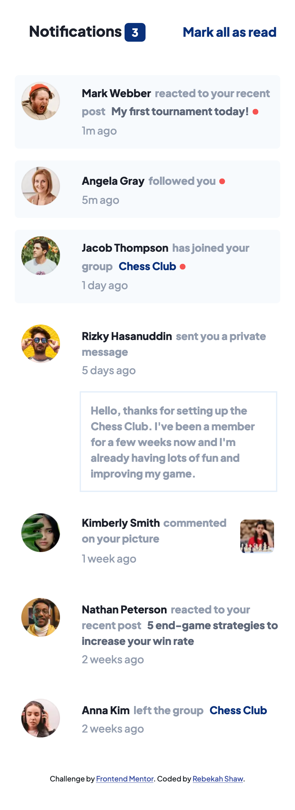

# Frontend Mentor - Notifications page solution

This is a solution to the [Notifications page challenge on Frontend Mentor](https://www.frontendmentor.io/challenges/notifications-page-DqK5QAmKbC). Frontend Mentor challenges help you improve your coding skills by building realistic projects. 

## Table of contents

- [Overview](#overview)
  - [The challenge](#the-challenge)
  - [Screenshot](#screenshot)
  - [Links](#links)
- [My process](#my-process)
  - [Built with](#built-with)
  - [What I learned](#what-i-learned)
  - [Continued development](#continued-development)
  - [Useful resources](#useful-resources)
- [Author](#author)

## Overview

### The challenge

Users should be able to:

- Distinguish between "unread" and "read" notifications
- Select "Mark all as read" to toggle the visual state of the unread notifications and set the number of unread messages to zero
- View the optimal layout for the interface depending on their device's screen size
- See hover and focus states for all interactive elements on the page

### Screenshot

#### Desktop

#### Mobile

### Links

- Solution URL: [Solution](https://github.com/rebekahshaw92//notifications-page)
- Live Site URL: [Live Site](https://rebekahshaw92.github.io//notifications-page/)

### Built with

- Semantic HTML5 markup
- CSS custom properties
- Sass
- JavaScript
- Bootstrap 5
- Mobile-first workflow

### What I Learned 

While doing this project I got the chance to continue vorking with Bootstrap 5 and jQuery. As it had been a while since I had worked with jQuery I had to refesh my memory as to how change the background colour of an element when a link is clicked.

### Continued Development

I would like to continued working both with Bootstrap 5 and jQuery.

### Userful Resources 

- [Bootstrap](https://getbootstrap.com) - This site helped me learn all I needed to know about Bootstrap.

## Author

- Website - [Rebekah Shaw](https://www.rebekahshaw.com)
- Frontend Mentor - [@rebekahshaw92](https://www.frontendmentor.io/profile/rebekahshaw92)
- Twitter - [@x_beckyboo_x](https://www.twitter.com/x_beckyboo_x)
